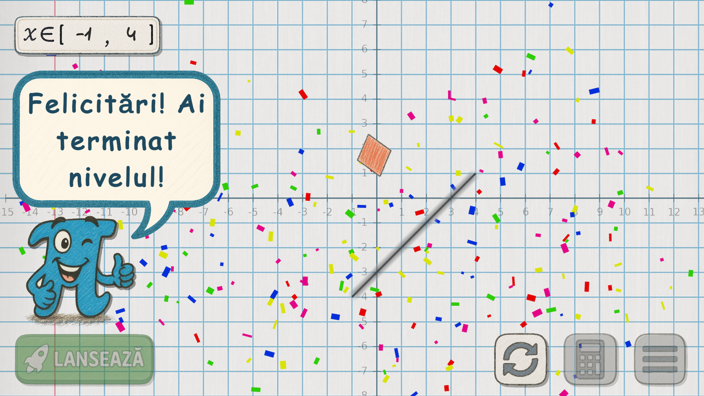

# PI's Adventure

## Informații generale

**Categorie:** Educațional  
**Județ:** Argeș  
**GitHub:** https://github.com/bogdanluca14/PI-s-Adventure  
(Codul Sursă, Documentație avansată, Screenshoturi și Aplicația propriu-zisă)

## Descriere

"PI's Adventure" este o aplicație educațională captivantă, menită să ajute la **învățarea și exersarea funcțiilor matematice** într-un mod plăcut și interactiv, având la bază **peste 4700 de linii de cod**. În implementarea ei au fost folosite sisteme avansate și eficiente de **Encoding, Function Plottering, Expression Building, JSON Smart Saving System**, precum și alte tehnici disponibile în **Codul Sursă** documentat în detaliu pe GitHub.

Concret, aceasta îi permite utilizatorului:
- **să înțeleagă** ce sunt funcțiile și cum se modifică graficele în funcție de variabile;
- **să creeze** funcții proprii pentru a propulsa protagonistul "PI" prin niveluri pline de obstacole;
- **să testeze** și să creeze niveluri personalizate pe care le poate împărtăși altora;
- **să își dezvolte** creativitatea și gândirea.

## Funcționalități

1. ### Învățare interactivă
   - Documentație **detaliată**, cu **exemple** și **explicații ilustrate**;
   - Vizualizare grafică pentru concepte abstracte: **domeniu de definiție**, funcții **liniare**, **pătratice**, **polinomiale**, **trigonometrice** etc.

2. ### Niveluri bine-structurate
   - Fiecare nivel este o provocare unică: obstacole strategice și stele greu accesibile, care dezvoltă **gândirea logică și analitică**;
   - Nivelurile sunt grupate în raport cu tipul funcției, având o **dificultate crescătoare**.

3. ### Sistem inteligent de evaluare
   - **Save automat** — progresul (inclusiv funcțiile scrise) se salvează la ieșirea din nivel sau aplicație;
   - Scor bazat pe **lungimea și numărul funcțiilor scrise**, încurajând soluții optimizate;
   - **Live‑feedback** — la fiecare modificare a funcției sau a domeniului, graficul se actualizează automat.

4. ### Editor de niveluri personalizate
   - Interfață pentru **plasarea, mutarea și ștergerea obstacolelor** — utilizatorul poate deveni designer de niveluri;
   - Generare automată a unui **cod unic (10–20 caractere)** pentru încărcarea nivelului, fără a avea nevoie de internet.

5. ### Meniu de setări și navigare
   - Ajustarea **volumului muzicii și efectelor sonore**;
   - Acces rapid la documentație sau meniul principal de oriunde în aplicație;
   - Interfață **intuitivă**, prietenoasă și accesibilă, pentru **începători** și **avansați**.

## Tehnologii

Aplicația "PI’s Adventure" a fost construită folosind:

- **Unity** – motorul aplicației  
- **C#** – limbaj de programare  
- **Photoshop** – crearea graficii
- **LaTeX** – formatare matematică  
- **DOTween** – animații UI  

## Aplicație educațională STEM

"PI’s Adventure" poate fi folosit ca instrument în **educația formală și non‑formală**:

- în **școli** – lecții, recapitulări, concursuri  
- în **tabere** și activități extracurriculare  
- pentru **învățare acasă**

### Exemplu de utilizare:
Un profesor poate da elevilor teme de vacanță constând în niveluri create cu ajutorul aplicației și distribuite prin **coduri unice**.

## Cerințe de sistem

- **Sistem de operare:** Windows 10 sau versiuni ulterioare;
- **Conectare internet:** **nu este necesară** în utilizare.

## Realizatori

**Luca Bogdan‑Alexandru**  
- **Școala:** Colegiul Național "Ion C. Brătianu"
- **Clasa:** a X‑a  
- **Județ:** Argeș  
- **Oraș:** Pitești

## Screenshoturi

